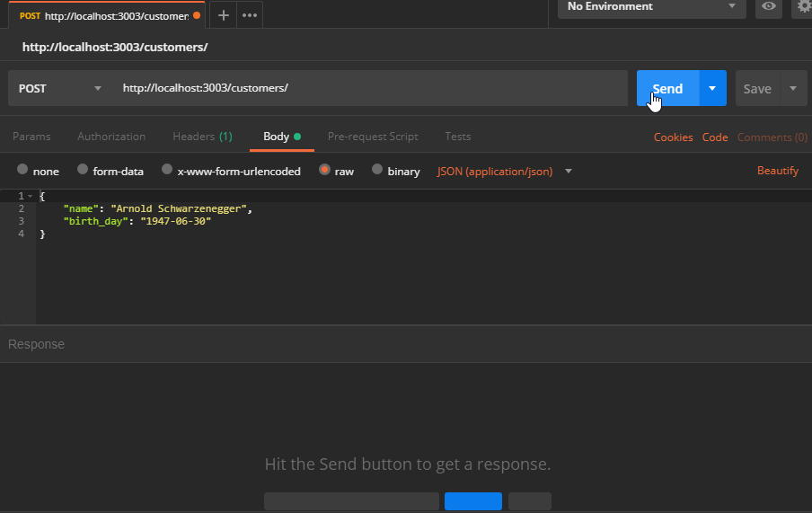
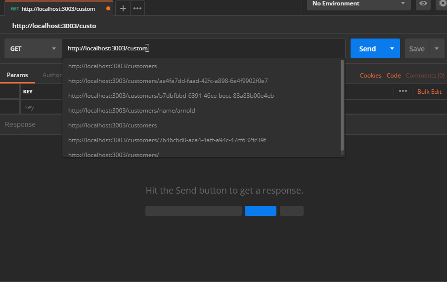
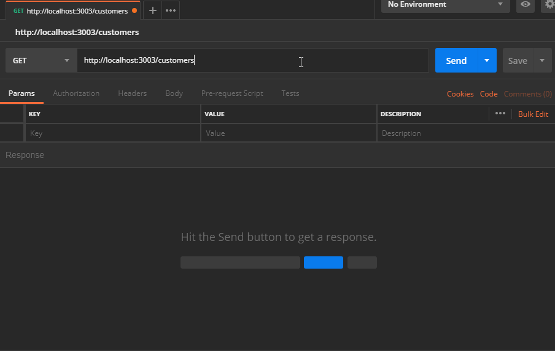
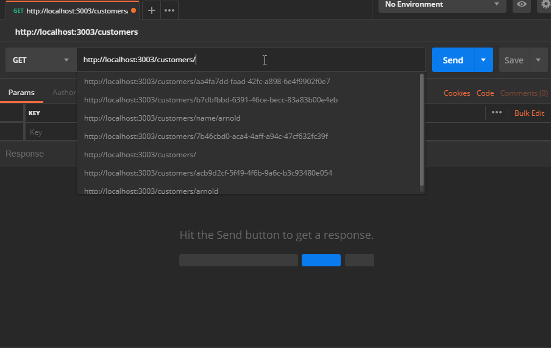
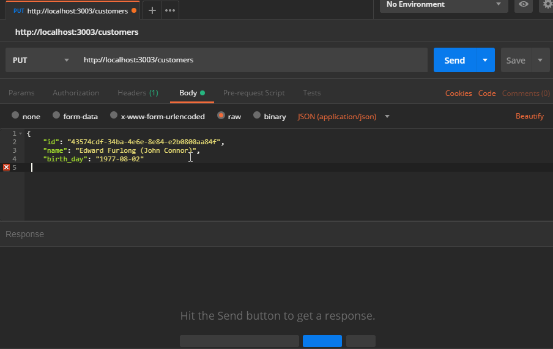
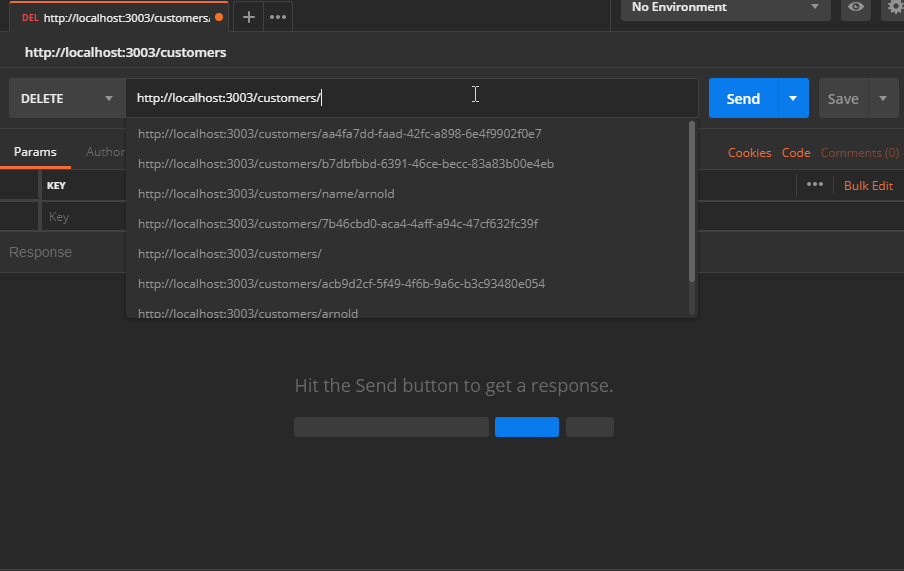

# Simple API to access MySQL database, using NodeJS and Express

---

**Database Schema**

* *create database* 

```sql
CREATE DATABASE `uuid-test` 
/*!40100 DEFAULT CHARACTER SET utf8mb4 COLLATE utf8mb4_0900_ai_ci */ 
/*!80016 DEFAULT ENCRYPTION='N' */;
```

* *create table* 

```sql
CREATE TABLE `customers` (
  `id` binary(16) NOT NULL,
  `name` varchar(255) DEFAULT NULL,
  `birth_day` date DEFAULT NULL,
  PRIMARY KEY (`id`)
) ENGINE=InnoDB DEFAULT CHARSET=utf8mb4 COLLATE=utf8mb4_0900_ai_ci;
```

---

* *clone this project*
    ```sh
    git clone https://github.com/kaichiro/uuid-api-mysql-test.git
    cd uuid-api-mysql-test
    ```

* *Configuration file (database connect)*
  * *.env (e.g.)*
    ```
    APP_PORT=3003

    SHOW_SQL_CMD=true

    DB_HOST=127.0.0.1
    DB_PORT=3306
    DB_DATABASE=uuid-test
    DB_USER=root
    DB_PASSWORD=
    ```

* *initialize this project*
    ```sh
    npm install
    npm start
    ```
    or
    ```sh
    yarn && yarn start
    ```

---

**Base URL:** `http://localhost:3003`

---

**Method: POST**

* *create:* 
  * target: `/`
  * request (body)
    ```sh
    {
        "name": "Arnold Schwarzenegger",
        "birth_day": "1986-10-02T03:00:00.000Z"
    }
    ```
  * result:
    ```sh
    {
        "id": "acb9d2cf-5f49-4f6b-9a6c-b3c93480e054",
        "name": "Arnold Schwarzenegger",
        "birth_day": "1986-10-02T03:00:00.000Z"
    }
    ```

---

**Method: GET**

* *getAll:*
  * targe: `/`
  * result:
    ```sh
    [
        {
            "id": "acb9d2cf-5f49-4f6b-9a6c-b3c93480e054",
            "name": "Arnold Schwarzenegger",
            "birth_day": "1947-06-30T03:00:00.000Z"
        },
        {
            "id": "43574cdf-34ba-4e6e-8e84-e2b0800aa84f",
            "name": "Edward Furlong",
            "birth_day": "1977-08-02T03:00:00.000Z"
        }
    ]
    ```

* *getById:* 
  * targe: `/:id`
  * e.g.: `/acb9d2cf-5f49-4f6b-9a6c-b3c93480e054`
  * result:
    ```sh
    {
        "id": "acb9d2cf-5f49-4f6b-9a6c-b3c93480e054",
        "name": "Arnold Schwarzenegger",
        "birth_day": "1947-06-30T03:00:00.000Z"
    }
    ```

* *getLikeName:* 
  * taget: `/name/:name`
  * e.g.: `/arnold`
  * result:
    ```sh
    [
        {
            "id": "acb9d2cf-5f49-4f6b-9a6c-b3c93480e054",
            "name": "Arnold Schwarzenegger",
            "birth_day": "1947-06-30T03:00:00.000Z"
        }
    ]
    ```


---

**Method: PUT**

* *update:*
  * taget: `/`
  * request (body)
    ```sh
    {
        "id": "43574cdf-34ba-4e6e-8e84-e2b0800aa84f",
        "name": "Edward Furlong (John Connor)",
        "birth_day": "1977-08-02"
    }
    ```
  * result:
    ```sh
    {
        "id": "43574cdf-34ba-4e6e-8e84-e2b0800aa84f",
        "name": "Edward Furlong (John Connor)",
        "birth_day": "1977-08-02"
    }
    ```


---

**Method: DELETE**

* *deleteById:*
  * taget: `/:id`
  * e.g.: `/b7dbfbbd-6391-46ce-becc-83a83b00e4eb`
  * result:
    ```sh
    { "message": "Record deleted successfully!" }
    ```
    or
    ```sh
    { "message": "No records found to be deleted!" }
    ```


---
by [Kaichiro Fukuda](https://github.com/kaichiro)
